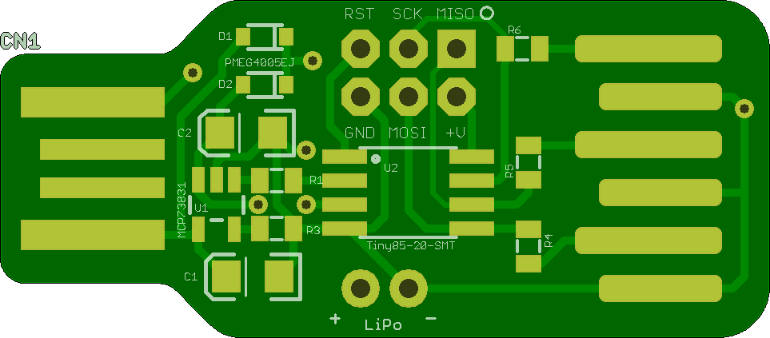
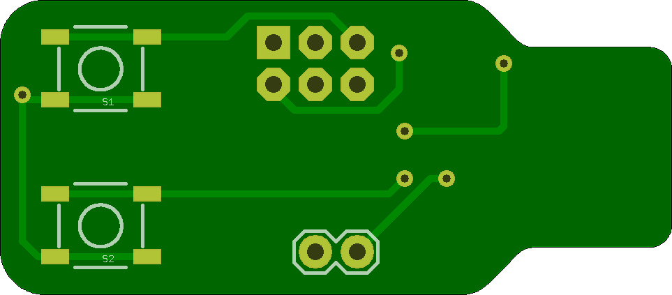
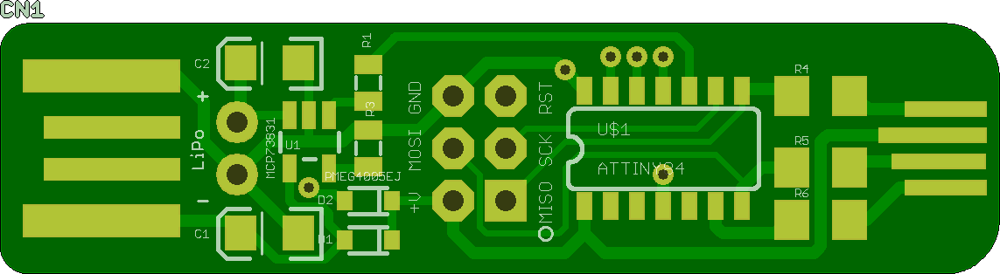
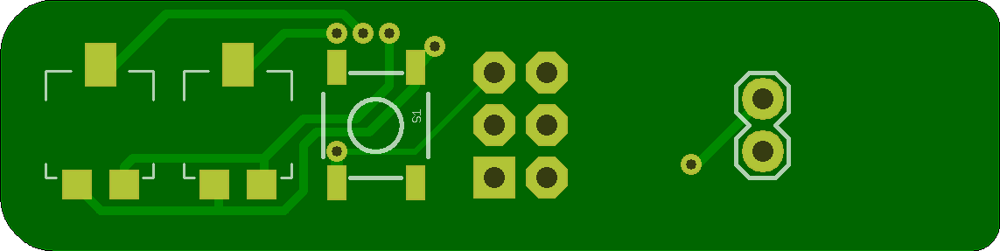
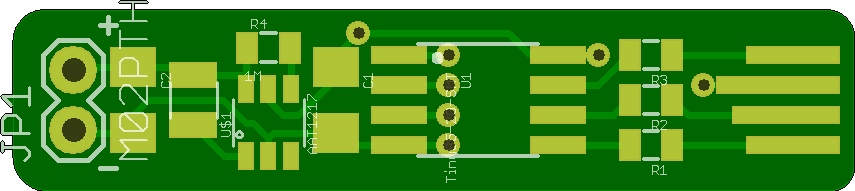
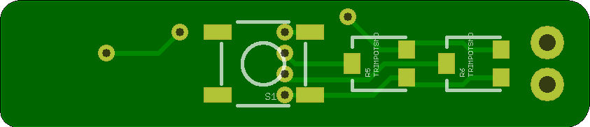
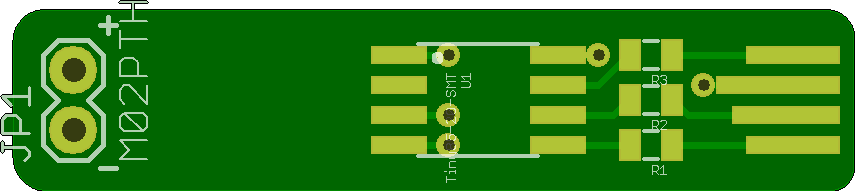
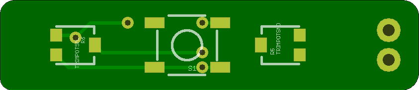
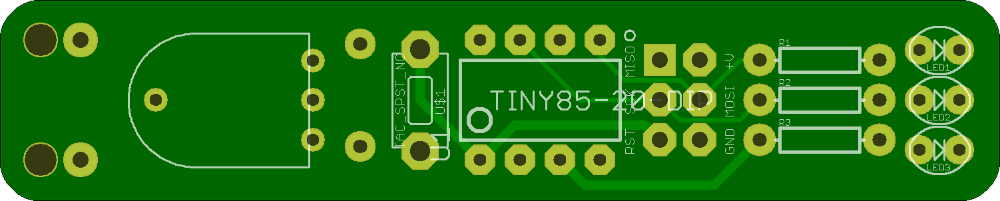
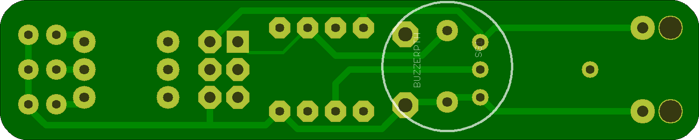

## LiPolyRGB 

### Board dimensions

* (160000, 70000) original units
* (1.6000, 0.7000) inches
* (40.6400, 17.7800) mm

| Front | Back |
| --- | --- |
|  |  |

## LiPolySonicScrewdriver 

### Board dimensions

* (190000, 47500) original units
* (1.9000, 0.4750) inches
* (48.2600, 12.0650) mm

| Front | Back |
| --- | --- |
|  |  |

## sonic_screwdriver 

### Board dimensions

* (139950, 29960) original units
* (1.3995, 0.2996) inches
* (35.5473, 7.6098) mm

| Front | Back |
| --- | --- |
|  |  |

## sonic_screwdriver_lipo 

### Board dimensions

* (139950, 29960) original units
* (1.3995, 0.2996) inches
* (35.5473, 7.6098) mm

| Front | Back |
| --- | --- |
|  |  |

## SonicScrewdriverThru 

### Board dimensions

* (249951, 49961) original units
* (2.4995, 0.4996) inches
* (63.4876, 12.6901) mm

| Front | Back |
| --- | --- |
|  |  |

